# Lab 1

### Using sed utility
#### 1- Display the lines that contain the word “lp” in /etc/passwd file.
sed -n '/pl/p' /etc/passwd
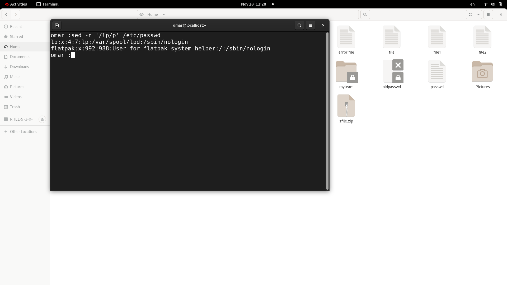
#### 2- Display /etc/passwd file except the third line.
sed '3d' /etc/passwd
(adm line deleted in display) 
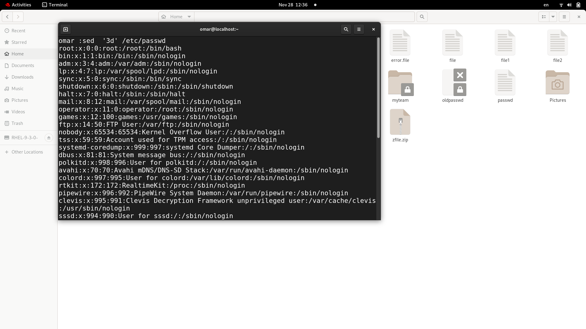
#### 3- Display /etc/passwd file except the last line.
sed '$d' /etc/passwd
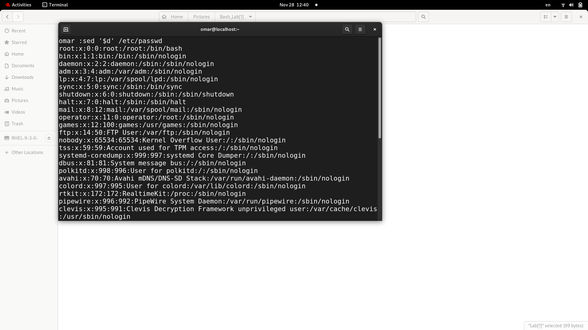
#### 4- Display /etc/passwd file except the lines that contain the word “lp”.
sed '/lp/d' /etc/passwd

#### 5- Substitute all the words that contain “lp” with “mylp” in /etc/passwd file.
sed 's/lp/mylp/g' /etc/passwd
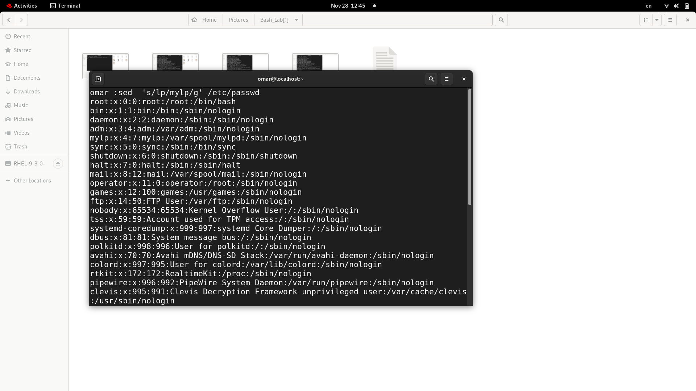
### Using awk utility
#### 1- Print full name (comment) of all users in the system.
awk -n -F: '{print $5}' /etc/passwd
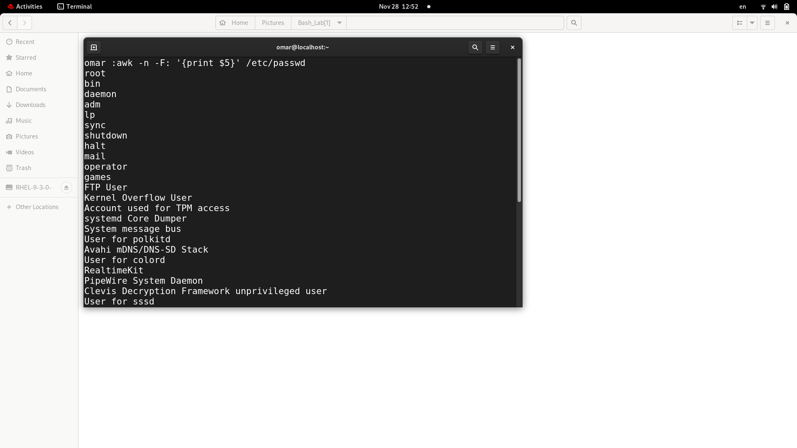
#### 2- Print login, full name (comment) and home directory of all users.( Print each line preceded by a line number)
awk -n -F: '{print NR ":" $1 ":" $3 ":" $5 ":" $6}' /etc/passwd
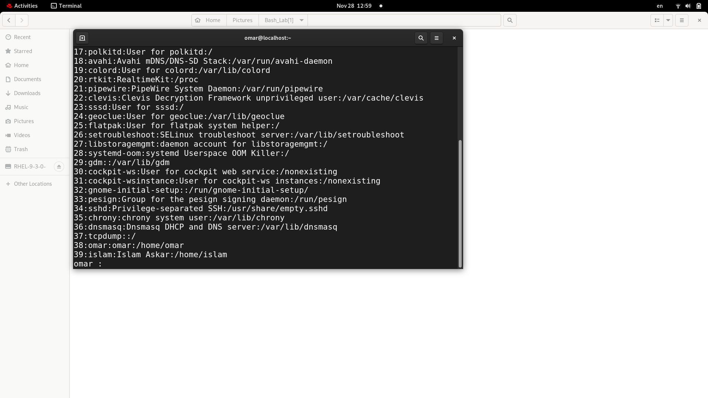
#### 3- Print login, uid and full name (comment) of those uid is greater than 500
awk -n -F: '{ if($3 > 500){print $1 ":" $3":" $5 ":" $6}}' /etc/passwd
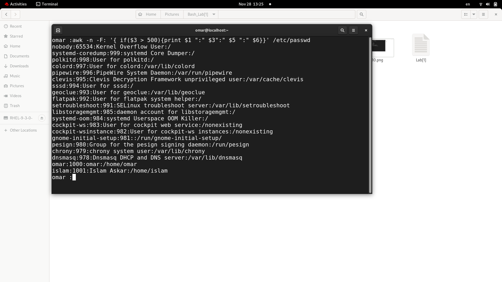
#### 4- Print login, uid and full name (comment) of those uid is exactly 500
awk -n -F: '{ if($3==500){print $1 ":" $3":" $5 ":" $6}}' /etc/passwd 
(no userid is equal 500)
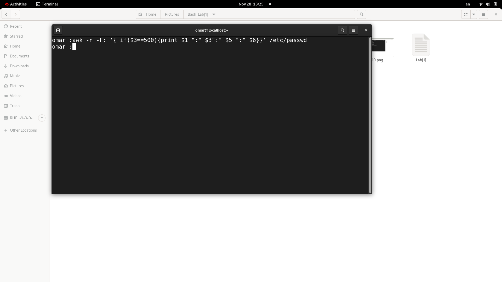
#### 5- Print line from 5 to 15 from /etc/passwd
awk  '{if(NR >=5&&NR<=15) print $0}' /etc/passwd
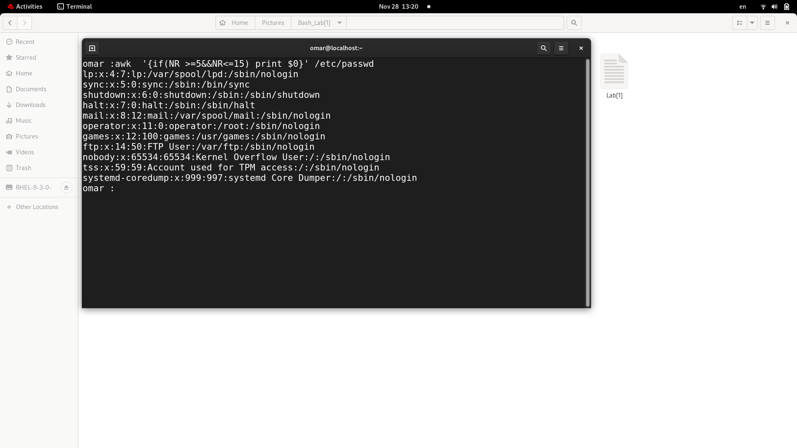
#### 6- Change lp to mylp
awk -F: '{for(i=1;i<NF;i++){if($i~"lp"){$i="mylp"; print $0}}}' /etc/passwd
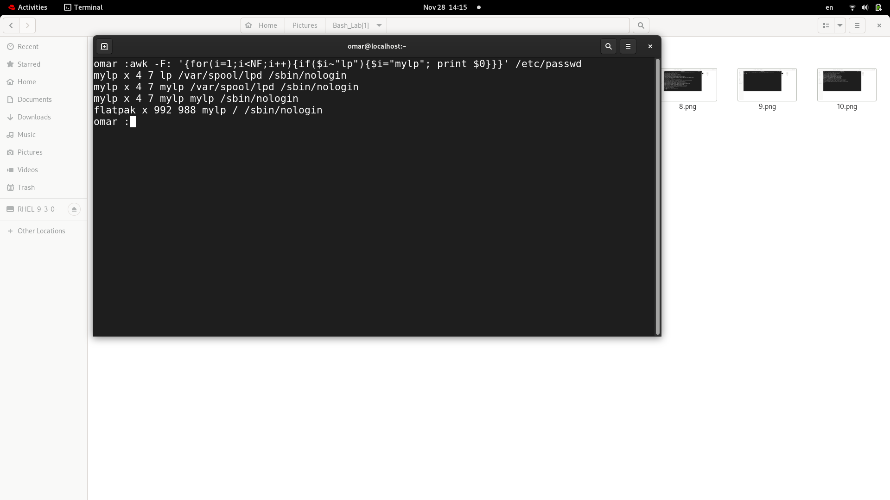
#### 7- Print all information about greatest uid.
awk -F: ' BEGIN{max=0} {if($3 > max){max = $3; maxline=$0}} END {print maxline}' /etc/passwd
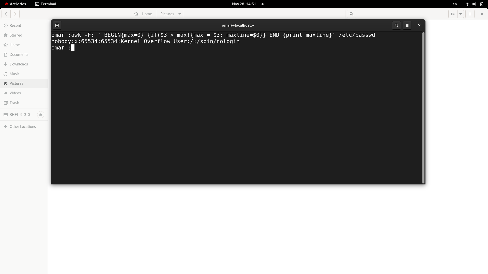
#### 8- Get the sum of all accounts id’s.
awk -F: '{sum=sum+ $3} END {print sum} ' /etc/passwd
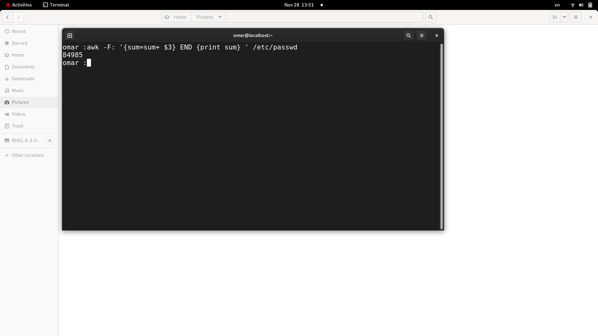
