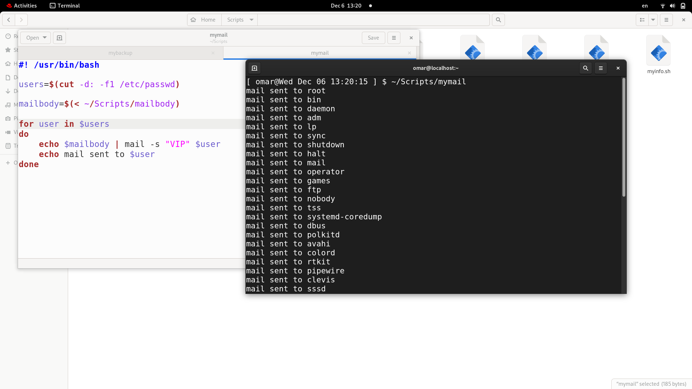

## 1. Write a script called mycase, using the case utility to checks the type of character 
entered by a user:
a. Upper Case.
b. Lower Case.
c. Number.
d. Nothing.

## 2. Enhanced the previous script, by checking the type of string entered by a user:
a. Upper Cases.
b. Lower Cases.
c. Numbers.
d. Mix.
e. Nothing.

## 3. Write a script called mychmod using for utility to give execute permission to all files and directories in your home directory.

## 4. Write a script called mybackup using for utility to create a backup of only files in your home directory.

##  5. Write a script called mymail using for utility to send a mail to all users in the system. 
### Note: write the mail body in a file called mtemplate. 

## 6. Write a script called chkmail to check for new mails every 10 seconds. Note: mails are saved in /var/mail/username.

## 7. What is the output of the following script
typeset –i n1
typeset –i n2
n1=1
n2=1
while test $n1 –eq $n2
do
n2=$n2+1
print $n1
if [ $n1 –gt $n2 ]
then
break
else
continue
fi
n1=$n1+1
print $n2
done
## output: 1 

## 8. Create the following menu:
a. Press 1 to ls
b. Press 2 to ls –a
c. Press 3 to exit 
Using select utility then while utility.

## 9. Write a script called myarr that ask a user how many elements he wants to enter in an 
## array, fill the array and then print it.

## 10.Write a script called myavg that calculate average of all numbers entered by a user. 
## Note: use arrays

## 11.Write a function called mysq that calculate square if its argument

